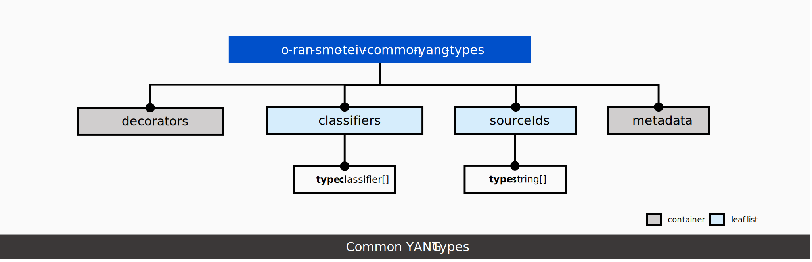
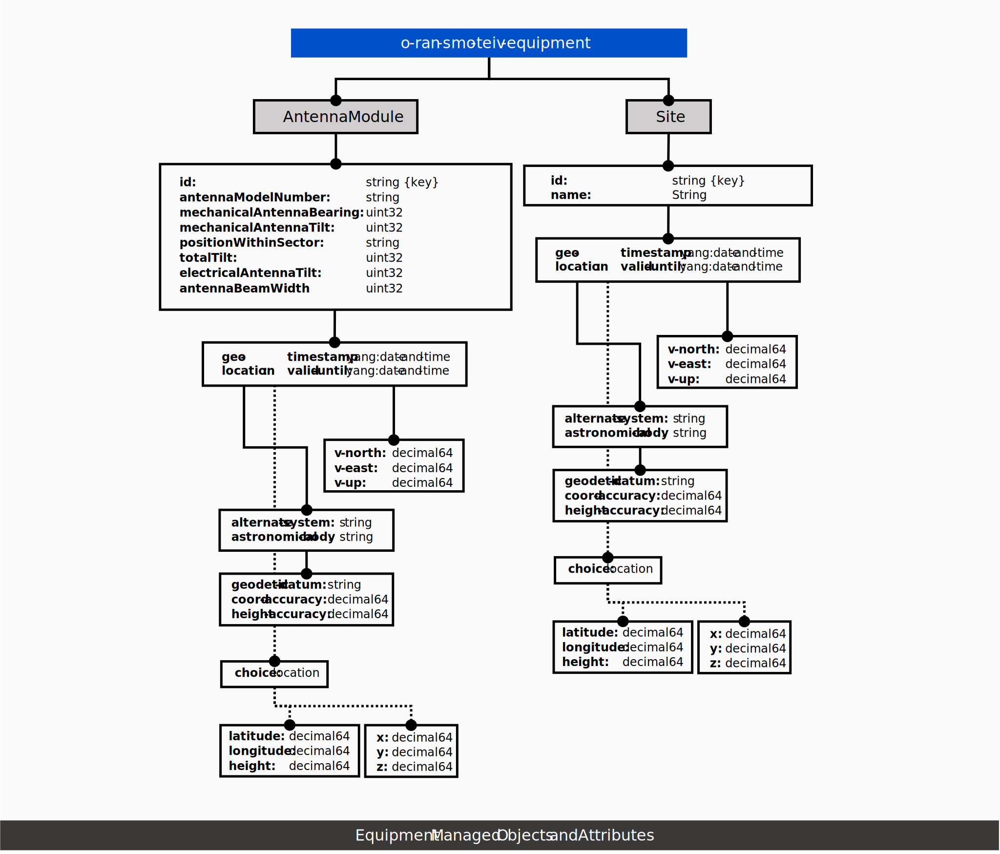
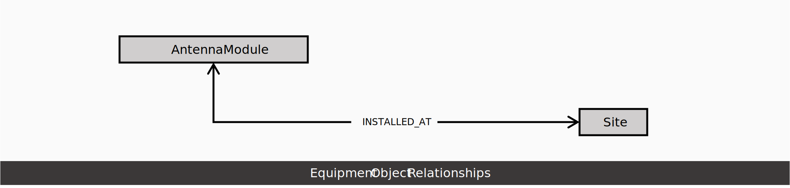
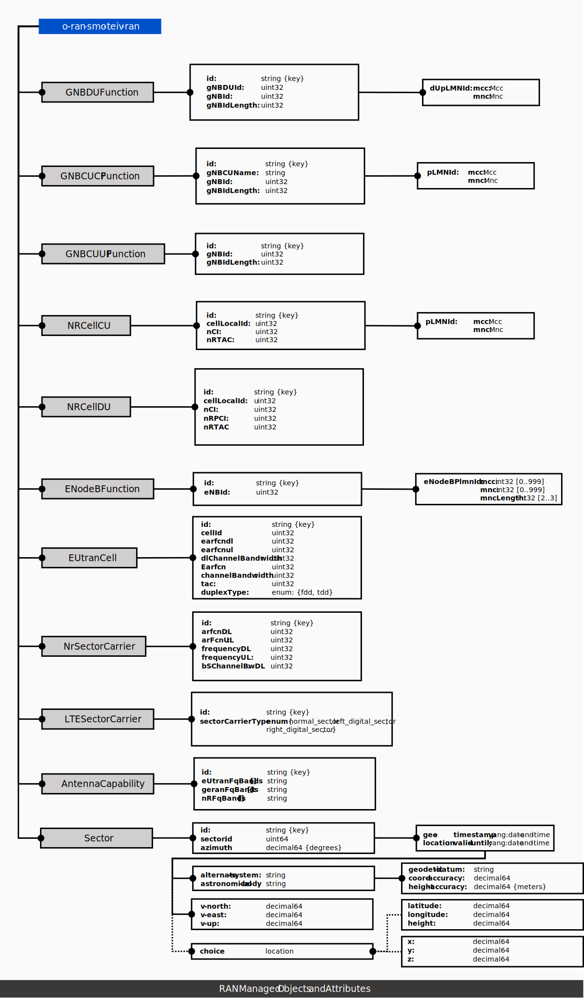
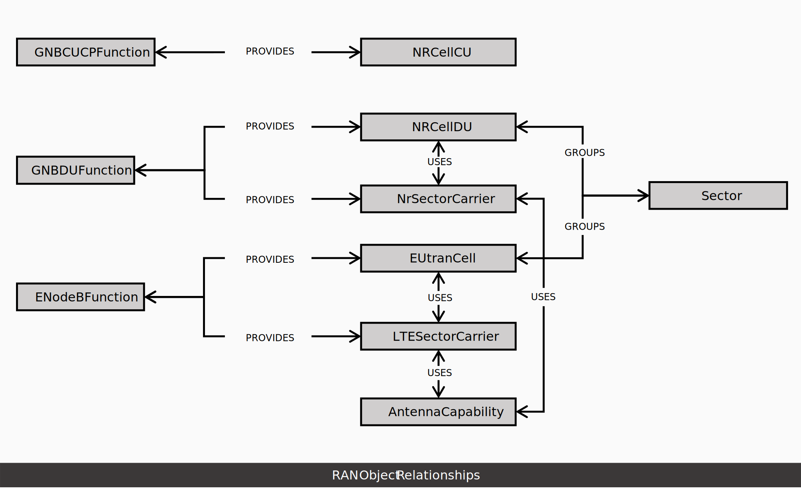
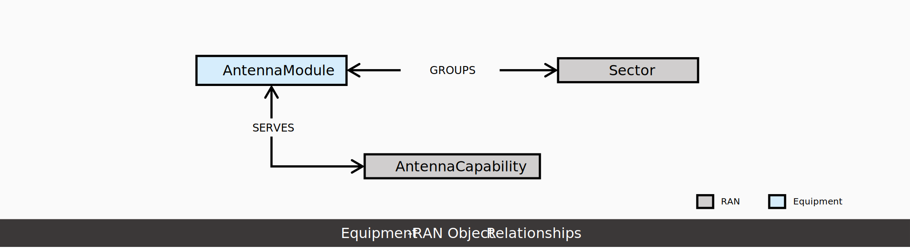
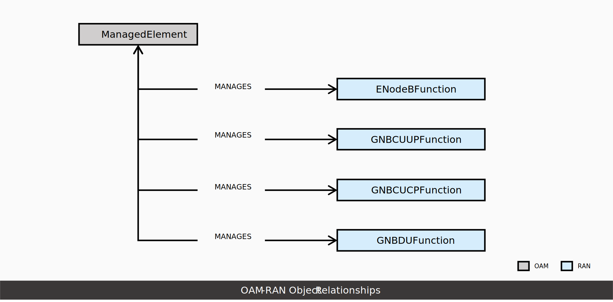

.. This work is licensed under a Creative Commons Attribution 4.0 International License.
.. SPDX-License-Identifier: CC-BY-4.0
.. Copyright (C) 2024 Nordix Foundation. All rights Reserved
.. Copyright (C) 2024 OpenInfra Foundation Europe. All Rights Reserved

Topology & Inventory Data Models
================================

The following are the currently supported modules in Topology &
Inventory.

Common YANG extensions
----------------------
.. literalinclude:: ../teiv/src/main/resources/models/o-ran-smo-teiv-common-yang-extensions.yang
   :language: yang

Common YANG types
-----------------

.. literalinclude:: ../teiv/src/main/resources/models/o-ran-smo-teiv-common-yang-types.yang
   :language: yang

Equipment
---------

.. literalinclude:: ../teiv/src/main/resources/models/o-ran-smo-teiv-equipment.yang
   :language: yang

RAN
---

.. literalinclude:: ../teiv/src/main/resources/models/o-ran-smo-teiv-ran.yang
   :language: yang

Relationship: Equipment RAN
---------------------------

.. literalinclude:: ../teiv/src/main/resources/models/o-ran-smo-teiv-equipment-to-ran.yang
   :language: yang

OAM
---

.. literalinclude:: ../teiv/src/main/resources/models/o-ran-smo-teiv-oam.yang
   :language: yang

Relationship: OAM RAN
---------------------

.. literalinclude:: ../teiv/src/main/resources/models/o-ran-smo-teiv-oam-to-ran.yang
   :language: yang
