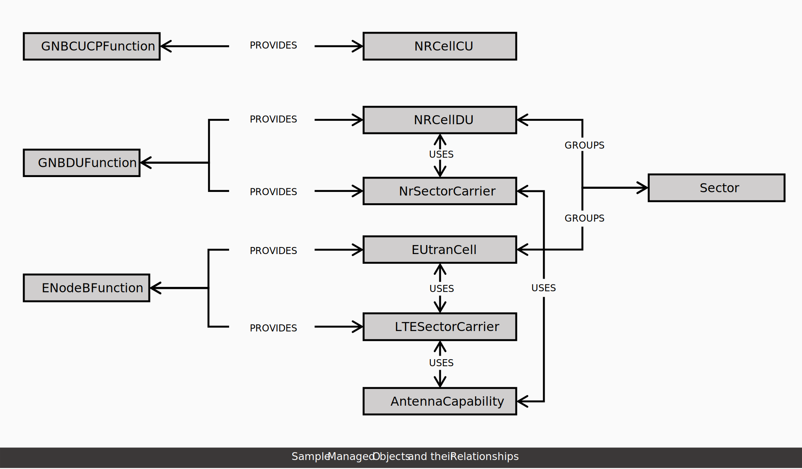

.. This work is licensed under a Creative Commons Attribution 4.0 International License.
.. SPDX-License-Identifier: CC-BY-4.0
.. Copyright (C) 2024 Nordix Foundation. All rights Reserved
.. Copyright (C) 2024 OpenInfra Foundation Europe. All Rights Reserved

Developer Guide
###############

Developer Guide Overview
========================

In this guide, we explore the use of Topology & Inventory to manage the
topology and inventory data in your network.

Introducing topology and inventory data
=======================================

Topology and inventory data is the information that represents entities
in a telecommunications network and the relationships between them that
provide insight into a particular aspect of the network of importance to
specific use cases. Topology and inventory data can be derived from
inventory, configuration, or other data. Topology & Inventory is being
updated autonomously based on changes in the network.

Topology & Inventory supports several topology and inventory domains,
see the :doc:`Data Models </data-models-guide>` for
details on the topology and inventory model. The understanding of the
model is important to enable a user making queries on topology and
inventory data. The entities are modeled as managed objects (found under
the schema in the data dictionary) and grouped together in modules based
on functionality. See
:ref:`Supported domains <Supported domains>`
for the list of the topology and inventory domains currently supported
in Topology & Inventory capability.

Concepts
--------

The building blocks of the Topology & Inventory are domains, entities,
and the relationships between each other. From a graph perspective,
entities are the vertices and relationships are the edges. These two
components are part of a subgraph, or the so-called domain. A
relationship can go beyond a single domain, since it can happen that the
two entities come from two separate ones. In this particular case, they
have a cross-domain relationship.

Domain
~~~~~~

A domain is a grouping of topology and inventory entities that handles
topology and inventory data. Topology and inventory data is the
information that represents entities in a telecommunications network and
the relationships between them that provides insight into a particular
aspect of the network of import to specific use cases. Topology and
inventory data can be derived from inventory, configuration, or other
data. Therefore, the topology and inventory model must define what the
telecoms network entities and relationships are. More information can be
found in :ref:`Supported domains <Supported domains>`.
The Topology Exposure and Inventory Management (TEIV) domain is the
parent domain used for entities and relationships. This domain can be
used in reading and querying topology and inventory data when the domain
name of an entity or relationship is not known.

Entity
~~~~~~

Entities are enabling the modelling and storage of complex network
infrastructure and relationships. The following are two examples of the
entities and their attributes from :doc:`Topology & Inventory Data
Models <data-models-guide>`.

.. image:: _static/sample-entities.svg
  :width: 900

Relationship
~~~~~~~~~~~~

It is a bi-directional connection between two entities, one of which is
the originating side (A-side) and the other is the terminating side
(B-side). The order of the sides matters since it defines the
relationship itself which must be unique. A relationship between two
entities is based on the effect that one has on the other. An entity can
have one or multiple relationships which can be defined by the user. A
possible relationship between ManagedElement and GNBDUFunction can be
*MANAGEDELEMENT_MANAGES_GNBDUFUNCTION*.

Topology & Inventory models
---------------------------

The Topology & Inventory objects are managed and standardized using YANG
models. These YANG models describe managed network entities and their
attributes, while also providing information on the relations between
the network entities. YANG data models are structured into modules and
submodules. Management instance data is a graph of objects which have
attributes (see the **schema** in the data models).

The :doc:`Topology & Inventory Data Models <data-models-guide>` includes:
- Modules for each supported domain that describe the structure of the
managed objects within it as well as any relationships between them. -
Modules that describe cross-domain relationships. - Modules that define
proprietary extensions and types used to describe the structure of
objects and attributes within the domains.

The following sample diagram shows some managed objects and their
relationships in the RAN domain.

A direct relationship is a connection between two entities without any
in-between entity and an indirect relationship contains at least one.
NRCellDU has direct relationships with GNBDUFunction and
NRSectorCarrier, while it also has indirect relationships with
ManagedElement, AntennaCapability, and AntennaModule.

Supported domains
-----------------

+-----------------------------------+-------------------------------------------------------+
| Domain                            | Description                                           |
+===================================+=======================================================+
| RAN                               | | This model contains the topology entities and       |
|                                   | | relations in the RAN domain, which represents the   |
|                                   | | functional capability of the deployed RAN that      |
|                                   | | are relevant to rApps use cases.                    |
+-----------------------------------+-------------------------------------------------------+
| EQUIPMENT                         | | This model contains the topology entities and       |
|                                   | | relations in the Equipment domain, which is         |
|                                   | | modeled to understand the physical location of      |
|                                   | | equipment such as antennas associated with a        |
|                                   | | cell/carrier and their relevant properties, for     |
|                                   | | example, tilt, max power, and so on.                |
+-----------------------------------+-------------------------------------------------------+
| OAM                               | | This model contains the topology entities and       |
|                                   | | relations in the O&M domain, which are intended     |
|                                   | | to represent management systems and management      |
|                                   | | interfaces.                                         |
+-----------------------------------+-------------------------------------------------------+
| REL_EQUIPMENT_RAN                 | | This model contains the topology relations          |
|                                   | | between Equipment and RAN.                          |
+-----------------------------------+-------------------------------------------------------+
| REL_OAM_RAN                       | | This model contains the topology relations          |
|                                   | | between O&M and RAN.                                |
+-----------------------------------+-------------------------------------------------------+
