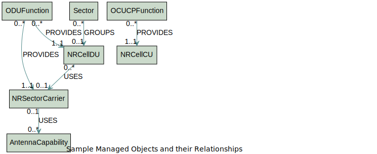

.. This work is licensed under a Creative Commons Attribution 4.0 International License.
.. SPDX-License-Identifier: CC-BY-4.0
.. Copyright (C) 2024 Nordix Foundation. All rights Reserved
.. Copyright (C) 2024-2025 OpenInfra Foundation Europe. All Rights Reserved

Developer Guide
###############

Developer Guide Overview
========================

In this guide, we explore the use of Topology & Inventory to manage the
topology and inventory data in your network.

Introducing topology and inventory data
=======================================

Topology and inventory data is the information that represents the entities
in a telecommunications network and the relationships between them. Topology
and inventory data can be derived from inventory and configuration. Topology
& Inventory is being updated autonomously based on changes in the network.

Topology & Inventory supports several topology and inventory domains,
see the :doc:`Data Models </data-models-guide>` for
details on the topology and inventory models. The understanding of the model
is important to enable a user making queries on topology and inventory data.
The entities are modeled as managed objects (under the schema in the data
dictionary) and grouped together in modules based on functionality. For
additional information, see
:ref:`Supported domains <Supported domains>`

Concepts
--------

The building blocks of the Topology & Inventory are domains, entities, and
the relationships between each other. From a graph perspective, entities are
the vertices and relationships are the edges. These two components are part of
a subgraph, or the so-called domain. A relationship can be a cross-domain
relationship when its entities belong to different domains.

Domain
~~~~~~

A domain is a grouping of topology and inventory entities that handles topology
and inventory data. The topology and inventory model defines what the telecoms
network entities and relationships are. More information can be found in
:ref:`Supported domains <Supported domains>`.
The Topology Exposure and Inventory Management (TEIV) domain is the parent domain
used for entities and relationships. This domain can be used in reading and querying
topology and inventory data when the domain name of an entity or relationship is not
known.

Entity
~~~~~~

Entities are enabling the modelling and storage of complex network
infrastructure and relationships. The following are two examples of the
entities and their attributes from :doc:`Topology & Inventory Data
Models <data-models-guide>`.

.. image:: _static/sample-entities.svg
  :width: 900

Relationship
~~~~~~~~~~~~

It is a bi-directional connection between two entities, one of which is
the originating side (A-side) and the other is the terminating side
(B-side). The order of the sides matters since it defines the
relationship itself which must be unique. A relationship between two
entities is based on the effect that one has on the other. An entity can
have one or multiple relationships which can be defined by the user. A
possible relationship between ManagedElement and ODUFunction can be
*MANAGEDELEMENT_MANAGES_ODUFUNCTION*.

Topology identifiers
~~~~~~~~~~~~~~~~~~~~

These identifiers are uniquely generated values used to identify objects within
Topology & Inventory.

    **NOTE:** To maintain robust design principles, Apps must avoid caching or
    depending on topology identifiers (id), as these identifiers are assigned to
    entities and relationships for data organization purposes only. Topology
    identifiers carry no intrinsic meaning.

Apps must rely on `sourceIds` which is a list that contains the URN prefixed source
identifiers of a topology object.

Understanding identifiers
^^^^^^^^^^^^^^^^^^^^^^^^^
Source IDs is a list which contains the URN prefixed FDNs of a topology entity. It
contains one or more entries (number of entries can be dependent on the vendor)

- Entities that can be derived directly from CM. These entities have only one instance
  of "`urn:3gpp:dn:`" within the sourceIds list. Examples of these are the ODUFunction
  and NRCellDU instances.
- Composite entities that cannot be derived directly from CM. These entities have
  multiple instances of "`urn:3gpp:dn:`" within the sourceIds list. An example of these
  entities are the AntennaModule instances.

Topology & Inventory models
---------------------------

The Topology & Inventory objects are managed and standardized using YANG
models. These YANG models describe managed network entities and their
attributes, while also providing information on the relations between
the network entities. YANG data models are structured into modules and
submodules. Management instance data is a graph of objects which have
attributes (see the **schema** in the data models).

The :doc:`Topology & Inventory Data Models <data-models-guide>` includes:

 - Modules for each supported domain that describe the structure of the
   managed objects within it as well as any relationships between them.
 - Modules that describe cross-domain relationships.
 - Modules that define proprietary extensions and types used to describe
   the structure of objects and attributes within the domains.

The following sample diagram shows some managed objects and their
relationships in the RAN domain.

A direct relationship is a connection between two entities without any
in-between entity and an indirect relationship contains at least one.
NRCellDU has direct relationships with ODUFunction and
NRSectorCarrier, while it also has indirect relationships with
ManagedElement, AntennaCapability, and AntennaModule.

Consumer Data
~~~~~~~~~~~~~

Consumer data is data that enriches Topology & Inventory models. It can be 
attached to topology entity or topology relation instance, outside of the
declared topology entity or topology relationship attributes.

Three types of consumer data are supported:

- Source IDs (read only)
- Classifiers (read and write)
- Decorators (read and write)

For information about how consumer data relates to the Topology & Inventory model
and how this information is encoded, see
:doc:`Topology & Inventory Data Models <data-models-guide>`

Metadata and reliability Indicator
~~~~~~~~~~~~~~~~~~~~~~~~~~~~~~~~~~

Metadata provides additional information about entities and relationships within the
database.

The **reliabilityIndicator** is used to indicate the status of the topology data
within the network. See the
:doc:`Common YANG Types <data-models/common-yang-types>`
in the Topology & Inventory Data Models for more information. It is implemented as a name-value
pair within the metadata column. It applies to every entity and relationship.

Values for **reliabilityIndicator**:

1. **RESTORED**: The data was restored from a backup and the responsible adapters are checking to ensure that the data is current.
2. **OK**: The data is in alignment with the source of truth, as far as Topology Exposure Handling is aware.
3. **ADVISED**: Entity implicitly created by Topology & Inventory Exposure Handling and potentially not aligned with the source of truth.

Supported domains
-----------------

+-----------------------------------+-------------------------------------------------------+
| Domain                            | Description                                           |
+===================================+=======================================================+
| RAN                               | | This model contains the topology entities and       |
|                                   | | relations in the RAN domain, which represents the   |
|                                   | | functional capability of the deployed RAN that      |
|                                   | | are relevant to rApps use cases.                    |
+-----------------------------------+-------------------------------------------------------+
| EQUIPMENT                         | | This model contains the topology entities and       |
|                                   | | relations in the Equipment domain, which is         |
|                                   | | modeled to understand the physical location of      |
|                                   | | equipment such as antennas associated with a        |
|                                   | | cell/carrier and their relevant properties, for     |
|                                   | | example, tilt, max power, and so on.                |
+-----------------------------------+-------------------------------------------------------+
| OAM                               | | This model contains the topology entities and       |
|                                   | | relations in the OAM domain, which are intended     |
|                                   | | to represent management systems and management      |
|                                   | | interfaces.                                         |
+-----------------------------------+-------------------------------------------------------+
| CLOUD                             | | This model contains the topology entities and       |
|                                   | | relations in the RAN CLOUD domain, which            |
|                                   | | comprises cloud infrastructure and deployment       |
|                                   | | aspects that can be used in the topology model.     |
+-----------------------------------+-------------------------------------------------------+
| PHYSICAL                          | | This model contains the topology entities and       |
|                                   | | relations in the Physical domain, which is          |
|                                   | | modeled to understand the physical appliances and   |
|                                   | | locations to be used in the topology model.         |
+-----------------------------------+-------------------------------------------------------+
| REL_EQUIPMENT_RAN                 | | This model contains the topology relations          |
|                                   | | between Equipment and RAN.                          |
+-----------------------------------+-------------------------------------------------------+
| REL_OAM_RAN                       | | This model contains the topology relations          |
|                                   | | between OAM and RAN.                                |
+-----------------------------------+-------------------------------------------------------+
| REL_CLOUD_RAN                     | | This model contains the Cloud to RAN Logical        |
|                                   | | topology relations.                                 |
+-----------------------------------+-------------------------------------------------------+
| REL_OAM_CLOUD                     | | This model contains the OAM to Cloud                |
|                                   | | topology relations.                                 |
+-----------------------------------+-------------------------------------------------------+
| REL_PHYSICAL_RAN                  | | This model contains the topology relationship       |
|                                   | | between the physical domain and the RAN domain.     |
+-----------------------------------+-------------------------------------------------------+
