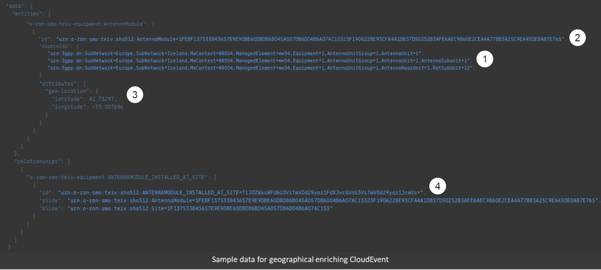

.. This work is licensed under a Creative Commons Attribution 4.0 International License.
.. SPDX-License-Identifier: CC-BY-4.0
.. Copyright (C) 2024 Nordix Foundation. All rights Reserved
.. Copyright (C) 2024-2025 OpenInfra Foundation Europe. All Rights Reserved

Discover and Reconciliation Interface Guide
###########################################

Discover and Reconciliation interface Guide Overview
====================================================

In this guide, we explore how to use the Discover and Reconciliation
interface API to enrich Topology & Inventory with geographical data.

Geographical enrichment
=======================

Discover and Reconciliation is the adding, modifying, and removing of
geographical entities that supports geographical information.
Geographical entities are associated to topology data. The following
geographical entities support geographical enrichment:

-  Sector
-  AntennaModule
-  Site

For information on the entity types and their supported relationships,
see the :doc:`Data Models </data-models-guide>`.

The format of the geographical enrichment message is CloudEvents.
Topology & Inventory uses `CloudEvents
Kafka® <https://cloudevents.github.io/sdk-java/kafka.html>`__ version
2.5.x. The link provides a sample CloudEvents implementation in Java®.
CloudEvents SDKs also supports other languages. See
`CloudEvents <https://cloudevents.io/>`__.

The “data” element consists of the actual topology and inventory data.
It contains all the geographical entities and their associated
relationships in application/json format, and each entity and
relationships are represented in application/yang-data+json format.

CloudEvents attributes are validated against the :doc:`Data Models
</data-models-guide>`. If there
is an unknown attribute in the CloudEvents, Topology & Inventory does
not drop the whole event but parses and persists only valid attributes,
and unknown parts are logged and ignored. If an empty or bad payload is
sent, the data is not persisted.

The value of non-mandatory fields can be deleted by sending a merge
request to set it to null. Null means that the value is not set.

Example of enrich Topology & Inventory with geographical data
-------------------------------------------------------------

This example creates a new topology Site entity and a relationship
between the Site and an AntennaModule. Using the
:ref:`create schema <Ingestion Create>`
the data producer can create entities that support geographical
enrichment. Attributes with null means not set.

Header:

.. code:: json

   {
       "ce_specversion": "1.0",
       "ce_id": "a30e63c9-d29e-46ff-b99a-b63ed83fd233",
       "ce_source": "dmi-plugin:nm-1",
       "ce_type": "topology-inventory-ingestion-create",
       "ce_time": "2023-06-12T09:05:00Z",
       "content-type": "application/json",
       "ce_dataschema": "topology-inventory-ingestion:events:create:1.0.0"
   }

Payload:

.. code:: json

    {
      "entities": [
        {
          "o-ran-smo-teiv-equipment:Site": [
            {
              "id": "urn:o-ran:smo:teiv:sha512:Site=8864DE35AF8F7552810308401DE712AD07877BBA7568860029BCECD3667F7A9D6DF5DFDA72BF475E5153BBE3035AAC229AD63DECC539C541B45598509088DB4E",
              "attributes": {
                "name": "Dublin",
                "geo-location": {
                  "latitude": 41.73297,
                  "longitude": -73.007696
                }
              },
               "sourceIds": [
                  "urn:oran:smo:teiv:atoll:Site=1"
               ]
            }
          ]
        },
        {
          "o-ran-smo-teiv-equipment:AntennaModule": [
            {
              "id": "urn:o-ran:smo:teiv:sha512:AntennaModule=1FEBF137533843657E9E9DBE60DBD86B045A057DB6D04B6A07AC15323F1906228E93CFA4A1DB37D50252B3AFE6AEC9860E2CEA4A77BB3A25C9EA45DEDA87E765",
              "attributes": {
                "geo-location": {
                  "latitude": 41.73297,
                  "longitude": -73.007696
                }
              },
                "sourceIds": [
                  "urn:3gpp:dn:ManagedElement=NR01,Equipment=1,AntennaUnitGroup=1,AntennaUnit=1",
                  "urn:3gpp:dn:ManagedElement=NR01,Equipment=1,AntennaUnitGroup=1,AntennaUnit=1,AntennaSubunit=1",
                  "urn:3gpp:dn:ManagedElement=NR01,Equipment=1,AntennaUnitGroup=1,AntennaNearUnit=1,RetSubUnit=1",
                  "urn:cmHandle:72538B1D598FA5A901D945A187D5542A"
              ]
            }
          ]
        }
      ],
      "relationships": [
        {
          "o-ran-smo-teiv-equipment:ANTENNAMODULE_INSTALLED_AT_SITE": [
            {
              "id": "urn:o-ran:smo:teiv:sha512:ANTENNAMODULE_INSTALLED_AT_SITE=E725018642FCC6D9BD7EB846DF31F080B878420A9C5E002CFB39F2AAEB6D3D66E655A132DB0852C6984B2052ABB62B1815A9C802A35ED865F8992328F1144C25",
              "aSide": "urn:o-ran:smo:teiv:sha512:AntennaModule=1FEBF137533843657E9E9DBE60DBD86B045A057DB6D04B6A07AC15323F1906228E93CFA4A1DB37D50252B3AFE6AEC9860E2CEA4A77BB3A25C9EA45DEDA87E765",
              "bSide": "urn:o-ran:smo:teiv:sha512:Site=8864DE35AF8F7552810308401DE712AD07877BBA7568860029BCECD3667F7A9D6DF5DFDA72BF475E5153BBE3035AAC229AD63DECC539C541B45598509088DB4E",
               "sourceIds": [
                  "urn:3gpp:dn:ManagedElement=NR01,Equipment=1,AntennaUnitGroup=1,AntennaUnit=1",
                  "urn:3gpp:dn:ManagedElement=NR01,Equipment=1,AntennaUnitGroup=1,AntennaUnit=1,AntennaSubunit=1",
                  "urn:3gpp:dn:ManagedElement=NR01,Equipment=1,AntennaUnitGroup=1,AntennaNearUnit=1,RetSubUnit=1",
                  "urn:cmHandle:72538B1D598FA5A901D945A187D5542A",
                  "urn:oran:smo:teiv:atoll:Site=1"
               ]
            }
          ]
        }
      ]
    }

Example of modify enriched Topology & Inventory with geographical data
----------------------------------------------------------------------

This example updates an existing Site entity. Using the
:ref:`merge schema <Ingestion Merge>`
the data producer can update entities that support geographical
enrichment.

Header:

.. code:: json

   {
     "ce_specversion": "1.0",
     "ce_id": "a30e63c9-d29e-46ff-b99a-b63ed83fd234",
     "ce_source": "dmi-plugin:nm-1",
     "ce_type": "topology-inventory-ingestion-merge",
     "ce_time": "2023-06-12T09:05:00Z",
     "content-type": "application/json",
     "ce_dataschema": "topology-inventory-ingestion:events:merge:1.0.0"
   }

Payload:

.. code:: json

    {
      "entities": [
        {
          "o-ran-smo-teiv-equipment:Site": [
            {
              "id": "urn:o-ran:smo:teiv:sha512:Site=8864DE35AF8F7552810308401DE712AD07877BBA7568860029BCECD3667F7A9D6DF5DFDA72BF475E5153BBE3035AAC229AD63DECC539C541B45598509088DB4E",
              "attributes": {
                "name": "Dublin",
                "geo-location": {
                  "latitude": 52.73297,
                  "longitude": -84.007696
                }
              },
               "sourceIds": [
                  "urn:oran:smo:teiv:atoll:Site=1"
               ]
            }
          ]
        },
        {
          "o-ran-smo-teiv-equipment:AntennaModule": [
            {
              "id": "urn:o-ran:smo:teiv:sha512:AntennaModule=3FF03633DCCAF1C44409FA0D0D3C32F00635DDAD5363A5E175A04A4AE5125641FCC6D727801275E8E6879AFB6D342B3E9473CC1307A702E41389882ECB513C8A",
              "attributes": {
                "geo-location": {
                  "latitude": 52.73297,
                  "longitude": -84.007696
                }
              },
                "sourceIds": [
                  "urn:3gpp:dn:ManagedElement=NR01,Equipment=1,AntennaUnitGroup=1,AntennaUnit=2",
                  "urn:3gpp:dn:ManagedElement=NR01,Equipment=1,AntennaUnitGroup=1,AntennaUnit=2,AntennaSubunit=1",
                  "urn:3gpp:dn:ManagedElement=NR01,Equipment=1,AntennaUnitGroup=1,AntennaNearUnit=2,RetSubUnit=1",
                  "urn:cmHandle:72538B1D598FA5A901D945A187D5542A"
                ]
            }
          ]
        }
      ],
      "relationships": [
        {
          "o-ran-smo-teiv-equipment:ANTENNAMODULE_INSTALLED_AT_SITE": [
            {
              "id": "urn:o-ran:smo:teiv:sha512:ANTENNAMODULE_INSTALLED_AT_SITE=3F3C6E552965769E31FB0E25FE805A25981B47A50AE3115BE5C74EB018866D79524A4D30D92E30EF547A3208CA8F88041136608319826B577C66E63A1CB0AA82",
              "aSide": "urn:o-ran:smo:teiv:sha512:AntennaModule=3FF03633DCCAF1C44409FA0D0D3C32F00635DDAD5363A5E175A04A4AE5125641FCC6D727801275E8E6879AFB6D342B3E9473CC1307A702E41389882ECB513C8A",
              "bSide": "urn:o-ran:smo:teiv:sha512:Site=8864DE35AF8F7552810308401DE712AD07877BBA7568860029BCECD3667F7A9D6DF5DFDA72BF475E5153BBE3035AAC229AD63DECC539C541B45598509088DB4E",
               "sourceIds": [
                  "urn:3gpp:dn:ManagedElement=NR01,Equipment=1,AntennaUnitGroup=1,AntennaUnit=2",
                  "urn:3gpp:dn:ManagedElement=NR01,Equipment=1,AntennaUnitGroup=1,AntennaUnit=2,AntennaSubunit=1",
                  "urn:3gpp:dn:ManagedElement=NR01,Equipment=1,AntennaUnitGroup=1,AntennaNearUnit=2,RetSubUnit=1",
                  "urn:cmHandle:72538B1D598FA5A901D945A187D5542A",
                  "urn:oran:smo:teiv:atoll:Site=1"
               ]
            }
          ]
        }
      ]
    }

Example of delete enriched data from Topology & Inventory
---------------------------------------------------------

This example deletes a topology Site entity and its relationship to an
AntennaModule entity. Using the
:ref:`delete schema <Ingestion Delete>`
the data producer can delete entities that support geographical
enrichment.

Header:

.. code:: json

   {
       "ce_specversion": "1.0",
       "ce_id": "a30e63c9-d29e-46ff-b99a-b63ed83fd235",
       "ce_source": "dmi-plugin:nm-1",
       "ce_type": "topology-inventory-ingestion-delete",
       "ce_time": "2023-06-12T09:05:00Z",
       "content-type": "application/json",
       "ce_dataschema": "topology-inventory-ingestion:events:delete:1.0.0"
   }

Payload:

.. code:: json

    {
      "entities" : [
        {
          "o-ran-smo-teiv-equipment:Site": [
            {
              "id": "urn:o-ran:smo:teiv:sha512:Site=8864DE35AF8F7552810308401DE712AD07877BBA7568860029BCECD3667F7A9D6DF5DFDA72BF475E5153BBE3035AAC229AD63DECC539C541B45598509088DB4E"
            }
          ]
        }
      ],
      "relationships": [
        {
          "o-ran-smo-teiv-equipment:ANTENNAMODULE_INSTALLED_AT_SITE": [
            {
              "id" : "urn:o-ran:smo:teiv:sha512:ANTENNAMODULE_INSTALLED_AT_SITE=3F3C6E552965769E31FB0E25FE805A25981B47A50AE3115BE5C74EB018866D79524A4D30D92E30EF547A3208CA8F88041136608319826B577C66E63A1CB0AA82"
            }
          ]
        }
      ]
    }

How to create and produce an event
==================================

To create and produce an event, you can use the `CloudEventBuilder.v1
and
KafkaProducer <https://cloudevents.github.io/sdk-java/kafka.html>`__.
The link provides a sample CloudEvents implementation in Java.
CloudEvents SDKs also supports other languages. See
`CloudEvents <https://cloudevents.io/>`__.

Understanding Topology & Inventory ``id``
=========================================

When performing geographical enrichment of entities, the ``id`` value of the data, that is being enriched in
Topology & Inventory, must match the ``id`` value for the entity or the relationship within the
CloudEvent ``data`` element.

There are two types of entities:

- Entities that can be derived directly from CM. In the Topology & Inventory, these entities have only one
  instance with the prefix **urn:3gpp:dn:** within the ``sourceIds`` list. Use this value as the entity ``id``
  value within the CloudEvents ``data`` element.
- Composite entities are entities that cannot be derived directly from CM. These entities have multiple instances
  of **urn:3gpp:dn:** within the ``sourceIds`` list. The entity ``id`` value must be constructed from the list of
  elements in the ``sourceIds`` list.

The following is a sample CloudEvent for enriching an entity with geographical location information.

1. The list values for ``sourceIds`` is used to create the entity ``id``.
2. The ``id`` is used to identify the correct entity.
3. Geographical information enriches the entity.
4. The relationship ``id`` is created from the aSide and bSide values which are the entity ``id``'s.

To get the ``id`` values for composite entities, the advised method is to query the entities for matching
``sourceIds`` elements, see :doc:`Topology & Inventory API <api-documentation>`. This
can result in several matches where the same source entity participates in multiple topology entities.
Otherwise, the entity ``id`` value and relationship ``id`` value are created as follows:

How to create a composite entity ``id``
---------------------------------------

Composite entities are derived from multiple source domain elements.

1. Get ``sourceIds`` of the composite entity.

Example:

::

   "sourceIds": [
      "urn:3gpp:dn:SubNetwork=Europe,SubNetwork=Ireland,MeContext=NR004,ManagedElement=me04,Equipment=1,AntennaUnitGroup=1,AntennaUnit=1",
      "urn:3gpp:dn:SubNetwork=Europe,SubNetwork=Ireland,MeContext=NR004,ManagedElement=me04,Equipment=1,AntennaUnitGroup=1,AntennaUnit=1,AntennaSubunit=1",
      "urn:3gpp:dn:SubNetwork=Europe,SubNetwork=Ireland,MeContext=NR004,ManagedElement=me04,Equipment=1,AntennaUnitGroup=1,AntennaNearUnit=1,RetSubUnit=12"
   ]

2. In the given order, combine each ``id`` with the prefix **urn:3gpp:dn** only. Separate the ``id``'s with ``;``.

Format:

::

   <urn:3gpp:dn:Entity1>;<urn:3gpp:dn:Entity2>;...;<urn:3gpp:dn:EntityN>

Example:

::

   urn:3gpp:dn:SubNetwork=Europe,SubNetwork=Ireland,MeContext=NR004,ManagedElement=me04,Equipment=1,AntennaUnitGroup=1,AntennaUnit=1;
   urn:3gpp:dn:SubNetwork=Europe,SubNetwork=Ireland,MeContext=NR004,ManagedElement=me04,Equipment=1,AntennaUnitGroup=1,AntennaUnit=1,AntennaSubunit=1;
   urn:3gpp:dn:SubNetwork=Europe,SubNetwork=Ireland,MeContext=NR004,ManagedElement=me04,Equipment=1,AntennaUnitGroup=1,AntennaNearUnit=1,RetSubUnit=12

3. SHA-512 hash the combined ``id``'s.

Example:

::

   1FEBF137533843657E9E9DBE60DBD86B045A057DB6D04B6A07AC15323F1906228E93CFA4A1DB37D50252B3AFE6AEC9860E2CEA4A77BB3A25C9EA45DEDA87E765

4. Add the prefix **urn:o-ran:smo:teiv:sha512:** and the composite entity name = SHA-512 hashed ``id``'s.

Format:

::

   urn:o-ran:smo:teiv:sha512:<CompositeEntityName>=<SHA-512 hashed IDs>

Example:

::

   urn:o-ran:smo:teiv:sha512:AntennaModule=1FEBF137533843657E9E9DBE60DBD86B045A057DB6D04B6A07AC15323F1906228E93CFA4A1DB37D50252B3AFE6AEC9860E2CEA4A77BB3A25C9EA45DEDA87E765

How to create a relationship ``id``
-----------------------------------

1. Combine the ``id`` of aSide and the ``id`` of bSide, split by the relationshipType, in the format:

::

   <aSideID>:<relationshipType>:<bSideID>

Example:

::

   urn:3gpp:dn:SubNetwork=Europe,SubNetwork=Ireland,SubNetwork=ERBS01,ManagedElement=me01:
   MANAGEDELEMENT_MANAGES_ORUFUNCTION:
   urn:3gpp:dn:SubNetwork=Europe,SubNetwork=Ireland,SubNetwork=ERBS01,ManagedElement=me01,ORUFunction=1

2. SHA-512 hash the previous format.

Example:

::

   055b47d817332b373cc042fe29c4fcfc8ebe1f5e467d0085defdd017294d723d0c8dd09a6ed593a67fe5dfccad272a71d7e15b7cf74bc1c23cb4b68c5a1d7510

3. Add the prefix **urn:o-ran:smo:teiv:sha512:** and the relationship type = the SHA-512 hashed as follows:

::

   urn:o-ran:smo:teiv:sha512:<RelationshipType>=<SHA-512 hash>

Example:

::

   urn:o-ran:smo:teiv:sha512:MANAGEDELEMENT_MANAGES_ORUFUNCTION=055b47d817332b373cc042fe29c4fcfc8ebe1f5e467d0085defdd017294d723d0c8dd09a6ed593a67fe5dfccad272a71d7e15b7cf74bc1c23cb4b68c5a1d7510

Troubleshooting
===============

If CloudEvents were sent but no data was persisted, check validation
failures and logs. Update the CloudEvent based on the logs and send it again.
